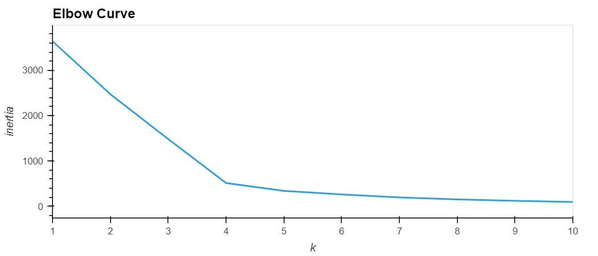

# Cryptocurrencies

## Overview of the Project:

In this project I intend to help Accountability Accounting, a prominent investment bank, to create a new cryptocurrency investment portfolio for its customers. Specifically, I am asked to create a report for Martha, a senior manager for the Advisory Services Team, that includes what cryptocurrencies are on the trading market and how they could be grouped to create a classification system for this new investment. For this purpose, I will use a cryptocurrencie dataset from cryptocompare.com and run a clustering analysis on it. In doing so, I will first load the data from a CSV file and read it as a dataframe usiong pandas library. Then, I will conduct several preprocessing actions including droping not-usable columns, transforming all data to numerical values, and downsizing the dataset to lower number of features using Principal Component Analysis (PCA). Then, using K-means clustering, I will group crypto data into 4 clusters on the principal components. Next using visualization libraries such hvplot.pandas and plotly.express, I will create 2D and 3D graphs representing the identified clusters and a table including details of ceryptocurrencies assinged to the clusters. Below are the screenshots of the results obtained through the above analyses.

## Results

* The dataset and jupyter notebook file including the codes for the analysis are stored in the **"Resources"** folder.
* The screenshots are saved in the "Images" folder.

### Elbow Curve
 

### 3D Scatter Plot of the Cluster (Based on the PCA data)

### Tradable Cryptocurrencies Table

### hvplot Scatter Plot ("TotalCoinsMined" against "TotalCoinSupply")

